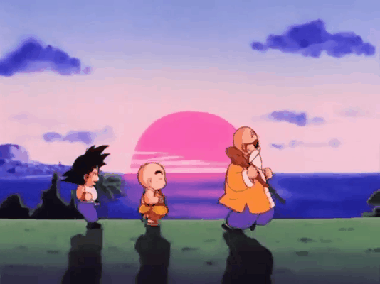

<div align="center">


<br /><br />

<a href="https://www.linkedin.com/in/herberth-mamani/">
  
</a>


</div>

<br />

### 👋 Sobre mí

¡Buenas! 👋 Soy Herberth, estudiante de **Ingeniería de Sistemas**

Si me preguntan qué me gusta, es desarrollar **backend**: aunque a veces no cuerre, lo saco adelante con **C#, .NET y PostgreSQL** para la base de datos. Ahora, si me piden hacer **frontend**, la verdad la paso mal, pero igual me pongo a ello con **React y Tailwind CSS** hasta que quede funcionando.

---

### 🛠️ Stack Tecnológico

<div align="center">

| Categoría             | Herramientas                                                                |
| :-------------------- | :-------------------------------------------------------------------------- |
| **Backend & DB**      |     |
| **Frontend & Mobile** |  |
| **Entorno & Control** |  |

</div>

---

### 📌 Proyectos Destacados

<div align="center">

<table>
<tr>

<td width="50%" align="center">

<a href="https://github.com/Petra761/GorilaType">
  
</a>

<h3>🦍 GorilaType</h3>

<p>
  Mi proyecto actual. Un sitio de typing inspirado en Monkeytype,
  desarrollado mientras sigo mejorando arquitectura, UX y rendimiento.
</p>

<p>
  <code>React</code>
  <code>TypeScript</code>
  <code>TailwindCSS</code>
</p>

<a href="https://github.com/Petra761/GorilaType">
  
</a>

</td>

<td width="50%" align="center">

<a href="https://github.com/Petra761/Hospital3erNivel_Farmacia">
  
</a>

<h3>🏥 Hospital 3er Nivel - Farmacia</h3>

<p>
  Sistema de gestión de farmacia hospitalaria desarrollado
  con arquitectura basada en servicios.
</p>

<p>
  <code>.NET</code>
  <code>React</code>
  <code>PostgreSQL</code>
  <code>TailwindCSS</code>
</p>

<a href="https://github.com/Petra761/Hospital3erNivel_Farmacia">
  
</a>

</td>

</tr>

<tr>

<td width="50%" align="center">

<a href="https://github.com/Petra761/FoodSpot">
  
</a>

<h3>🍔 FoodSpot</h3>

<p>
  Aplicación móvil para descubrir y guardar lugares de comida.
  Uno de mis proyectos principales con React Native.
</p>

<p>
  <code>React Native</code>
  <code>TypeScript</code>
  <code>Expo</code>
</p>

<a href="https://github.com/Petra761/FoodSpot">
  
</a>

</td>

<td width="50%" align="center">

<h3>🚧 ¿Qué sigue?</h3>

<p>
  Probablemente otro proyecto que empiece diciendo
  <i>"este será sencillo"</i>.
</p>

</td>

</tr>
</table>

</div>

---

### 🐢 Filosofía

<div align="center">



<br /><br />

> _"Hay que trabajar, hay que aprender, hay que comer, hay que descansar y también hay que jugar; esas son las bases del entrenamiento del Maestro Roshi para tener una buena condición."_  
> — **Maestro Roshi** 🥋

</div>

---

### 📊 Actividad & Estadísticas

<div align="center">

  <!-- Snake Animation -->
  <picture>
    <source media="(prefers-color-scheme: dark)" srcset="https://raw.githubusercontent.com/Petra761/Petra761/output/github-contribution-grid-snake-dark.svg">
    <source media="(prefers-color-scheme: light)" srcset="https://raw.githubusercontent.com/Petra761/Petra761/output/github-contribution-grid-snake.svg">
    
  </picture>

<br /><br />

  <!-- GitHub Streak -->
  

<br /><br />

  <!-- Activity Graph -->
  

<!--START_SECTION:waka-->
**🐱 My GitHub Data** 

> 📦 137.5 kB Used in GitHub's Storage 
 > 
> 🏆 133 Contributions in the Year 2026
 > 
> 🚫 Not Opted to Hire
 > 
> 📜 18 Public Repositories 
 > 
> 🔑 4 Private Repositories 
 > 
**I Mostly Code in C#** 

```text
C#                       16 repos            ██████████████░░░░░░░░░░░   57.14 % 
TypeScript               7 repos             ██████░░░░░░░░░░░░░░░░░░░   25.00 % 
CSS                      2 repos             ██░░░░░░░░░░░░░░░░░░░░░░░   07.14 % 
Python                   1 repo              █░░░░░░░░░░░░░░░░░░░░░░░░   03.57 % 
PHP                      1 repo              █░░░░░░░░░░░░░░░░░░░░░░░░   03.57 % 
```


 Last Updated on 04/09/2026 01:26:48 UTC
<!--END_SECTION:waka-->

</div>

<br />

<div align="center">

</div>
